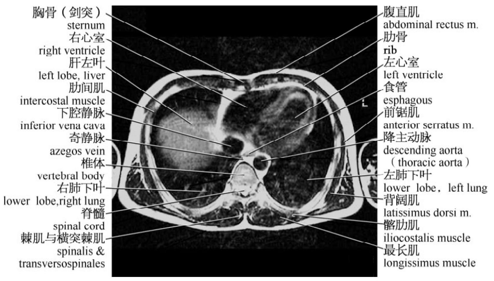
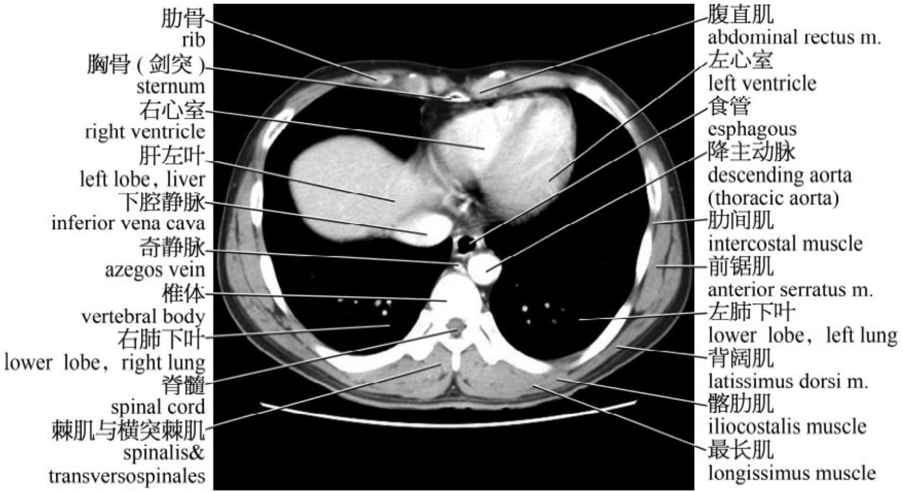

# 1.1 横轴面

---

图 1－1：横轴面 MRI（1）

图 1－2：横轴面 CT（1）

图 1－3：横轴面（1）示意图

图 1－4：横轴面 MRI（2）

图 1－5：横轴面 CT（2）

图 1－6：横轴面（2）示意图

图 1－7：横轴面 MRI（3）

图 1－8：横轴面 CT（3）

图 1－9：横轴面（3）

图 1－10：横轴面 MRI（4）

图 1－11：横轴面 CT（4）

图 1－12：横轴面（4）示意图

图 1－13：横轴面 MRI（5）

图 1－14：横轴面 CT（5）

图 1－15：横轴面（5）示意图

图 1－16：横轴面 MRI（6）

图 1－17：横轴面 CT（6）

图 1－18：横轴面（6）示意图

图 1－19：横轴面 MRI（7）

图 1－20：横轴面 CT（7）

图 1－21：横轴面（7）示意图

图 1－22：横轴面 MRI（8）

图 1－23：横轴面 CT（8）

图 1－24：横轴面（8）示意图

图 1－25：横轴面 MRI（8）

图 1－26：横轴面 CT（9）

图 1－27：横轴面（9）示意图

图 1－28：横轴面 MRI（10）

图 1－29：横轴面 CT（10）

图 1－30：横轴面（10）示意图

图 1－31：横轴面 MRI（11）

图 1－32：横轴面 CT（11）

图 1－33：横轴面（11）示意图

图 1－34：横轴面 MRI（12）

图 1－35：横轴面 CT（12）

图 1－36：横轴面（12）示意图

图 1－37：横轴面 MRI（13）

图 1－38：横轴面 CT（13）

图 1－39：横轴面（13）示意图

图 1－40：横轴面 MRI（14）

