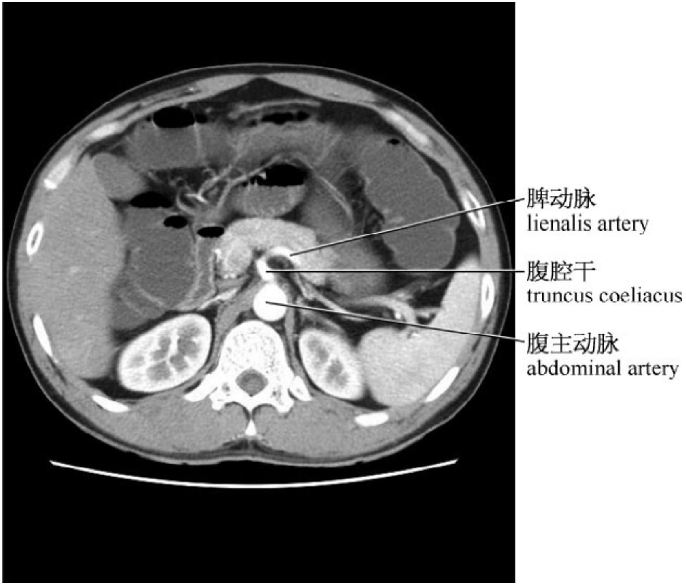
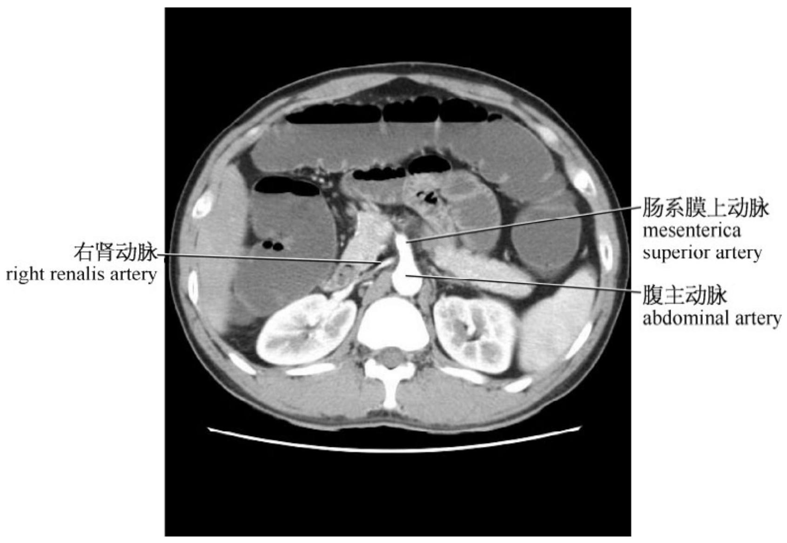
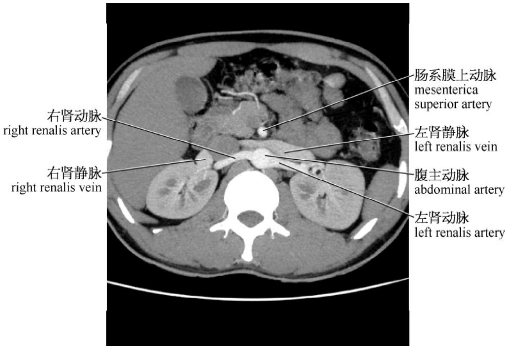
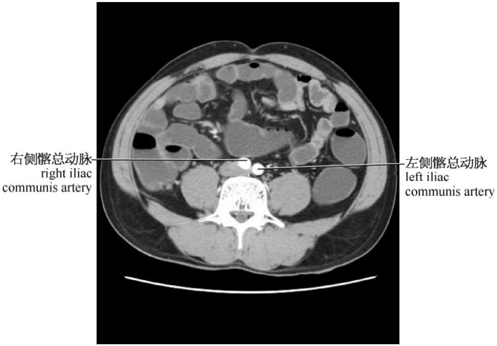
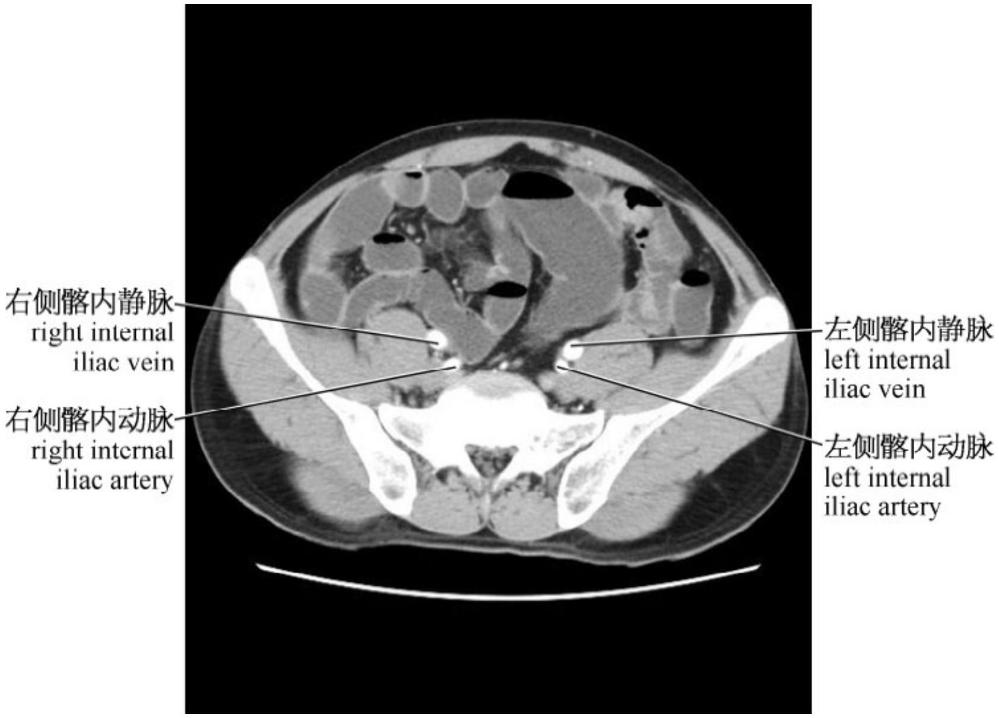
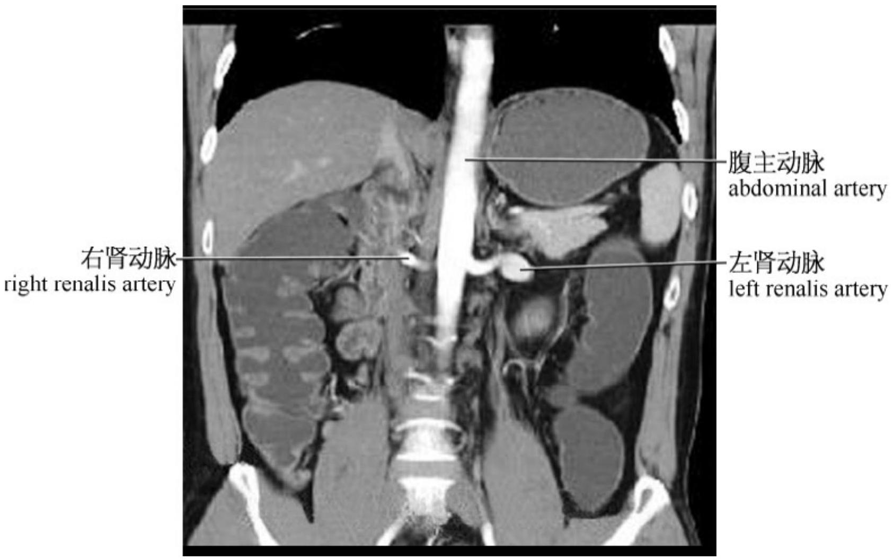
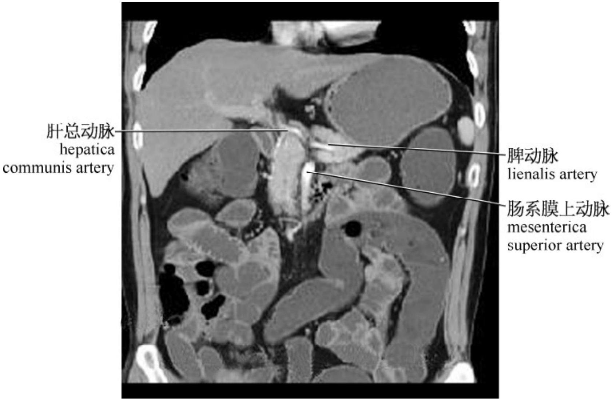
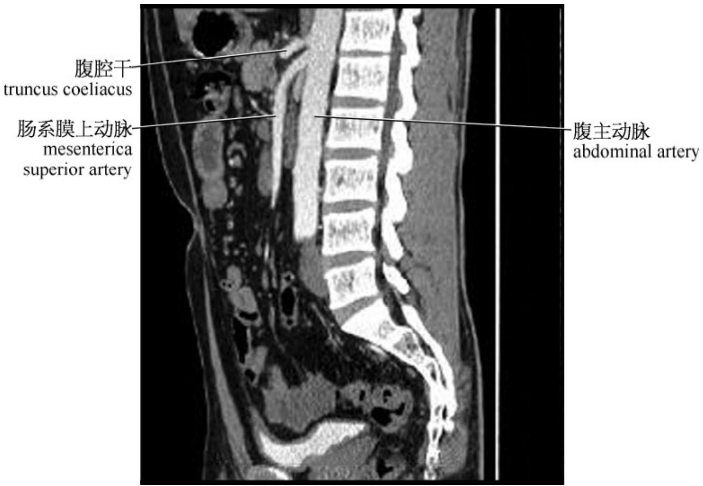

# 6.2 断面血管影像

轴位影像是我们阅读 CT 片的基础，因此有必要首先了解腹部血管的横断面影像解剖，以下是腹部主要血管的横断面影像。

图 6－1：腹腔干

图6－2：肠系膜上动脉

图6－3：双肾动脉

图 6－4：双侧髂总动脉

图 6－5：双侧髂内、外动静脉因血管走行不同，故在冠状面时显示的主要是向左右走行的血管，如双侧肾动脉能显示较为理想。

在矢状面时显示的主要是向前后走行的血管，如肠系膜上动脉及腹腔动脉能显示较为理想。

