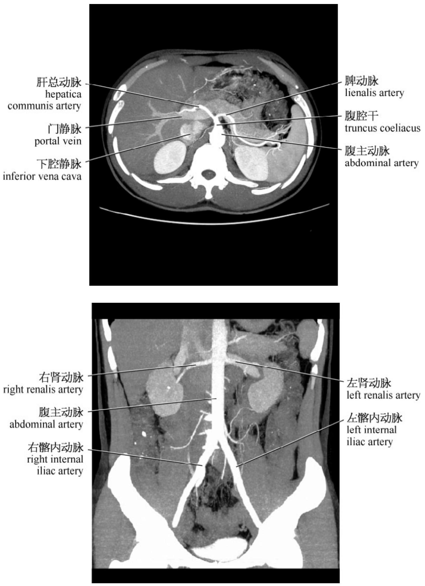
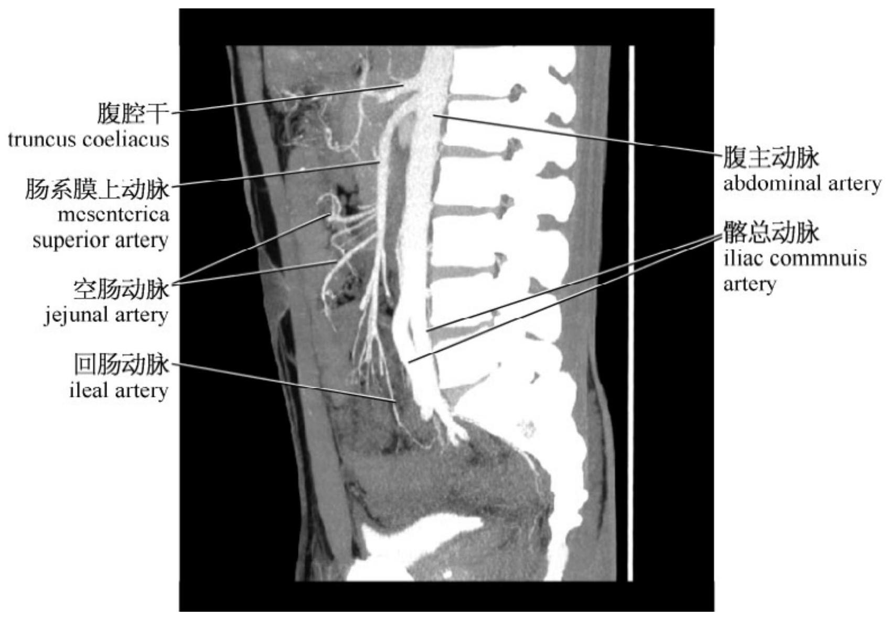
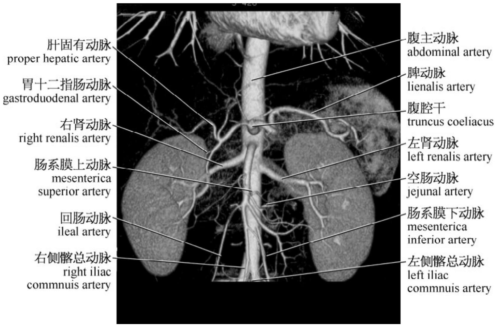
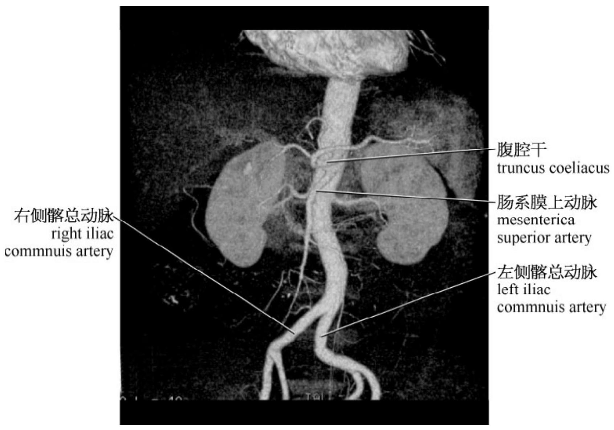

# 6.3 CTA 和 MRA 血管解剖

腹腔动脉——腹主动脉第一支主要分支血管，大约自 T12 至 L1 椎体间发出，一般血管开口指向前方。腹腔动脉常见有三个主要分支：肝总动脉，脾动脉，胃左动脉。

肠系膜上动脉——腹主动脉第二支主要分支血管，大约自 L1 椎体中部发出，一般血管开口指向前方偏右。

双侧肾动脉——腹主动脉第三对主要分支血管，大约自 L1 至 L2 椎体间发出，一般血管开口指向两侧，血管水平走行。

肠系膜下动脉——大约自 L3 椎体中部发出，一般血管开口指向前方偏左，通常血管较细。

双侧髂动脉——腹主动脉走行至 L4 椎体水平分叉形成。

