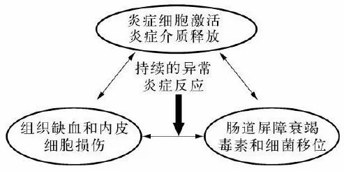

# 二、临床问题

## 1．2．0．1 为什么要提出多器官功能障碍综合征的概念？

多器官功能障碍综合征（MODS）的终末阶段是多器官功能衰竭。以 MODS 的概念代替多器官功能衰竭，反映了人们对多器官功能衰竭更为深入的认识和了解，将 MODS 定义为一个包括早期病理生理改变到终末期器官功能衰竭的连续的完整的病理生理过程，确立了动态和开放的 MODS 概念，为 MODS 的早期认识、早期诊断以及早期干预奠定了基础，具有重要的临床意义。

MODS 概念的提出是认识进步的结果，但确定较为合理的 MODS 定义仍然困难。为了避免割裂 MODS整个病理生理过程，美国胸科医师学会和美国危重病医学会提出了一个较为模糊的 MODS 定义，即各种疾病导致多个器官不能维持自身功能，从而影响全身内环境稳定性的状态。MODS 表述的器官功能障碍可以是相对的，也可以是绝对的，而且器官功能障碍是动态的、连续的变化过程，对器官功能的动态观察必将有助于 MODS 的早期诊断和治疗。

## 1．2．0．2 全身炎症反应综合征有何临床意义？

1991年在芝加哥召开的美国胸科医师学会和危重病医学会联席会议，将感染或创伤引起的持续全身炎症反应失控的临床表现命名为全身炎症反应综合征，并制定了相应的诊断标准（表1－1）。全身炎症反应综合征可由感染因素引起，若进行性加重可导致全身性感染（systemic infection 或 sepsis）、严重感染（severe sepsis）、感染性休克，甚至多器官功能障碍综合征（MODS）。全身炎症反应综合征也可由创伤、烧伤、急

性重症胰腺炎等非感染因素引起，进行性加重亦可引起 MODS。全身炎症反应综合征是感染或非感染因素导致机体过度炎症反应的共同特征，MODS 是全身炎症反应综合征进行性加重的最终后果。因此，就本质而言，全身炎症反应综合征是导致 MODS 的共同途径。

表 1－1：全身炎症反应综合征的诊断标准（符合下列两项或两项以上）

| 项 | 目 | 标 |

| :— | :— | :— |

| 体 | 温 | $>38^{\circ} \mathrm{C}$ 或 $<36^{\circ} \mathrm{C}$ |

| 心 | 率 | ＞90次／分 |

| 呼 | 吸 | 呼吸频率 $>20$ 次／分，或动脉血二氧化碳分压 $< 32 \mathrm{mmHg}(1 \mathrm{mmHg}=0.133 \mathrm{kPa})$ |

| 白 细 胞 | | 外周血白细胞 $>12 \times 10^{9} / \mathrm{L}$ 或 $<4 \times 10^{9} / \mathrm{L}$ 或幼稚杆状白细胞 $>10 \%$ |

尽管全身炎症反应综合征概念的提出是 MODS 认识上的重大进步，但全身炎症反应综合征的诊断标准本身存在许多不足，特别是把它作为一个综合征或疾病时，不能停留在诊断水平上，应积极寻找导致全身炎症反应综合征的致病因素。当然，我们也不能因为全身炎症反应综合征诊断标准存在问题而否认全身炎症反应综合征的重要意义。

## 1．2．0．3 怎么认识多器官功能障碍综合征的病理生理机制？

正常情况下，感染和组织创伤时，局部炎症反应对细菌清除和损伤组织修复都是必要的，具有保护性作用。当炎症反应异常放大或失控时，炎症反应对机体的作用从保护性转变为损害性，导致自身组织细胞死亡和器官衰竭。无论是感染性疾病（如严重感染、重症肺炎、急性重症胰腺炎后期），还是非感染性疾病（如创伤、烧伤、休克、急性胰腺炎早期等）均可能导致多器官功能障碍综合征（MODS）。可见，任何能够导致机体免疫炎症反应紊乱的疾病均可引起 MODS。从本质上来看，MODS 是机体炎症反应失控的结果。

感染、创伤是机体炎症反应的促发因素，而机体炎症反应的失控，最终导致机体自身性破坏，是 MODS的根本原因。炎症细胞激活和炎症介质异常释放、组织缺氧和自由基、肠道屏障功能破坏和细菌和（或）毒素移位均是机体炎症反应失控的表现，构成了 MODS 炎症反应失控的 3 个互相重叠的发病机制学说——炎症反应学说、自由基学说和肠道动力学说（图1－1）。

图1－1：多器官功能障碍综合征的发病机制

